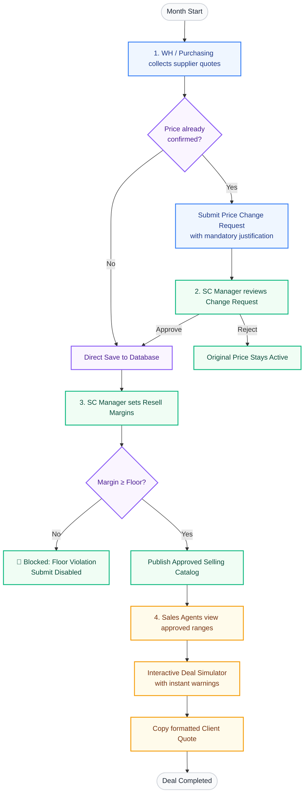

# FAERP — Enterprise Price & Margin Management System

FAERP is a secure, high-performance web platform designed to streamline monthly supplier price collections, enforce strict profit margin controls, and provide real-time pricing intelligence for sales agents. 

---

## 1. High-Level Business Workflow

Below is the workflow showing how different roles collaborate throughout the monthly cycle to ensure price accuracy and margin protection.



---

## 2. Core Features Offered (Client-Ready Presentation List)

This app is structured into three specialized access roles (Warehouse, Supply Chain Manager, Sales Agent) to ensure clean separation of duties and secure access control.

### 📦 A. Warehouse & Purchasing Module (Data Collection)
* **Guided Step-by-Step Collection**: A clean, two-step wizard where users select a product category, then select specific items to record pricing.
* **Smart Duplication Warning (Change Requests)**: If a purchasing officer attempts to alter a price that has already been submitted and confirmed for the month, the app forces them to submit a **Price Change Request** with a mandatory business justification.
* **Contextual Historical Matrix**: While entering prices, the input screen displays a 3-month, 6-month, or full history comparison grid for each supplier so purchasing agents can immediately spot vendor inflation or anomalies.

### 📊 B. Supply Chain Management Module (Controls & Analytics)
* **Real-time Pricing Engine**: Allows managers to dynamically calculate selling prices based on the cheapest, average, or highest supplier quote for the month.
* **Flexible Margin Modes**: Supports setting margins as a **Percentage (%)** of cost or a **Fixed Amount (EGP)**.
* **Margin Floor Enforcement**: Enforces a strict profit floor configured at either the Category level or Item level (which overrides the category floor). The UI blocks publishing if the proposed price drops below the minimum acceptable markup.
* **Independent Market Intelligence**: High-end charts and analytical gauges to track:
  * **Supplier Scorecard**: Identifies cost leaders and vendor participation/coverage rates.
  * **Month-over-Month Breakdowns**: Visualizes volatility spread (Min, Max, Avg) per month.
  * **Markup Strategy Advisor**: Suggests markup strategies based on calculated volatility levels.
* **Approval Dashboard**: An inbox containing all price changes submitted by the warehouse. The SC Manager can approve or reject with a custom review note.
* **Inline Monthly Review**: A collapsible, side-by-side dashboard modal showing every item in the catalog. Managers can quickly inspect all supplier quotes and submit selling prices item-by-item without leaving the screen.

### 🏷 C. Sales Agent Module (Quoting & Deal Simulation)
* **Secure Price Catalog**: Agents can view approved min/max selling prices for the month. To protect purchasing leverage, **raw buy costs are completely hidden** from sales agents.
* **Interactive Deal Simulator**: Agents can select any approved item, type in a target client quantity and unit price, and see the total contract value immediately.
* **Visual Compliance Indicators**: Displays green (compliant), yellow (above maximum), and red (below minimum allowed margin) warnings in real-time as agents type their pricing.
* **Active Session Deal Board**: Allows agents to combine multiple item quotes into a single deal board, check total profitability, and copy a formatted text summary to their clipboard for instant WhatsApp/email delivery to clients.

### 🌐 D. Core System Utilities
* **Multilingual RTL Support**: Fully localized in English and Arabic. RTL layout adjustments (aligned grids, padding, and font sizes) are applied automatically on language toggle.
* **Theme Customizer**: Toggle between clean light mode and premium dark mode interfaces.
* **Zero-Dependency PDF & Excel Generation**:
  * Export dynamic price requests for vendors with zebra-striped, auto-fitting columns.
  * Export manager spreadsheets with emerald headers, formatted currencies, and highlighted input fields.
  * On-screen print layouts optimized for physical archiving.
* **Automated Audit History**: Collapsible visual timeline showing every past price modification, who made it, and the stated reason.

---

## 3. Future Roadmap & Scaling Features

To transition this application from a single-site solution to an enterprise-wide SaaS or integrate it into a larger ERP ecosystem, the following scaling phases are recommended:

### 🔌 Phase 1: Supplier Self-Service Portal
* **Direct Supplier Portals**: Instead of purchasing officers manually copying quotes into the app, vendors are sent a secure, tokenized email link to input their prices directly into the database.
* **Auto-Reminder Workflows**: Automatic email/SMS alerts triggered on the 25th of the month for vendors who haven't updated their prices yet.

### 🧠 Phase 2: AI Pricing & Forecasting Engine
* **Predictive Volatility Alerts**: Machine learning models that analyze historical patterns to predict seasonal price spikes (e.g. predicting material cost increases ahead of Q3).
* **AI Margin Optimization**: Algorithms that automatically suggest the optimal markup range (Min/Max Sell) based on market demand curves, competitor pricing, and raw supplier fluctuation.

### 🌍 Phase 3: Global Enterprise Capabilities
* **Multi-Currency Support**: Automatically convert raw quotes in foreign currencies (USD, EUR, RMB) into EGP using real-time API exchange rates (e.g., Central Bank of Egypt integrations).
* **Multi-Warehouse / Multi-Branch Routing**: Supports multiple regional inventory centers, allowing the SC Manager to set regional pricing strategies or localized margin floors.

### ⛓ Phase 4: System Integration & APIs
* **ERP Connectors**: Pre-built sync endpoints to connect directly with tier-1 systems (SAP, Oracle, Odoo, or Microsoft Dynamics) to push approved selling catalogs directly to invoicing modules.
* **E-Commerce Sync**: Direct hook to update your client-facing Shopify, WooCommerce, or custom storefronts with the new approved selling prices instantly.

---

## 4. How to View the Flowchart in VS Code

VS Code does not natively render Mermaid diagrams inside its default Markdown preview. To view the flowchart properly:

1. **Install a Mermaid Extension**:
   - Open VS Code.
   - Click the Extensions icon on the left sidebar (or press `Ctrl+Shift+X`).
   - Search for **Markdown Preview Mermaid Support** (by Matt Bierner) and click **Install**.
   - Alternatively, you can install **Markdown Preview Enhanced** (by Yihua Shuyi) for advanced rendering options.
2. **Open the Preview Panel**:
   - Open `CLIENT_OVERVIEW.md` in VS Code.
   - Open the Command Palette (`Ctrl+Shift+P` on Windows/Linux or `Cmd+Shift+P` on macOS).
   - Search for and select: **Markdown: Open Preview to the Side** (or press `Ctrl+K V`).
   - The preview window will open next to your code editor, and the Mermaid flowchart under Section 1 will render dynamically into a beautiful flowchart.

---

## 5. How to Convert this Overview to PDF

To share this overview and the flowchart with clients or stakeholders as a PDF:

1. Locate the standalone **`CLIENT_OVERVIEW.html`** file in the root directory.
2. **Open in Browser**: Double-click `CLIENT_OVERVIEW.html` to open it in Google Chrome, Microsoft Edge, Safari, or Mozilla Firefox.
3. **Print to PDF**:
   - Press `Ctrl+P` (Windows/Linux) or `Cmd+P` (macOS) to open the print dialog.
   - Select **Save as PDF** as the destination printer.
   - Set **Layout** to **Portrait**.
   - Under *More Settings*, ensure **Background graphics** is checked (this preserves colors, badges, and the flowchart colors).
   - Click **Save** and select your destination folder.
   - The output PDF will render the fonts, colors, and Mermaid workflow diagram in high definition, ready for client delivery.

---

## 6. Setup Guide for First-Time Use

This application is designed for quick, self-contained installation with no external database dependencies.

### 📋 Prerequisites
- **Node.js** (v18.0.0 or higher)
- **NPM** (installed automatically with Node.js)

### 🚀 Step-by-Step Installation
1. **Unzip/Clone the Project**: Ensure the project directory is extracted on your local machine.
2. **Install Dependencies**: Open a terminal inside the project directory and run:
   ```bash
   npm install
   ```
3. **Launch the Application**: Run the development server:
   ```bash
   npm run dev
   ```
   *The SQLite database file will automatically create itself at `data/faerp.sqlite` and seed all default categories, items, suppliers, and historical pricing matrix data on first run.*
4. **Access the App**: Open your browser and navigate to:
   ```text
   http://localhost:3000
   ```

### 🔑 Default Demo User Credentials
You can log in to test different workflow perspectives:

| Role | Username | Password | Purpose & Capabilities |
| :--- | :--- | :--- | :--- |
| **Supply Chain Manager (SC)** | `sc` | `sc123` | Approves price changes, manages selling catalogs, sets margin floors, accesses the Admin Panel, and executes database purges. |
| **Warehouse Purchasing (WH)** | `wh` | `wh123` | Inputs monthly supplier quotes, files price change justifications, exports collection spreadsheets. |
| **Sales Agent (SA)** | `sa` | `sa123` | Uses the Deal Simulator, reads active selling price ranges, generates client quotes. |

### 🛡️ Administrative Database Purge Function
If you need to wipe all transaction records, supplier quotes, catalog categories/items, and margin configurations to start a clean cycle, follow these steps:
1. Log in as the Supply Chain Manager (`sc` / `sc123`).
2. Navigate to the Admin Panel (`/dashboard/admin` via the sidebar or top header).
3. Scroll to the bottom to the **Dangerous Zone**.
4. Enter the administrator purge password: `17012911`
5. Click **Wipe All Data Except Users**.
6. All catalog and transaction history is immediately wiped; the user database is preserved so your login credentials remain active.
