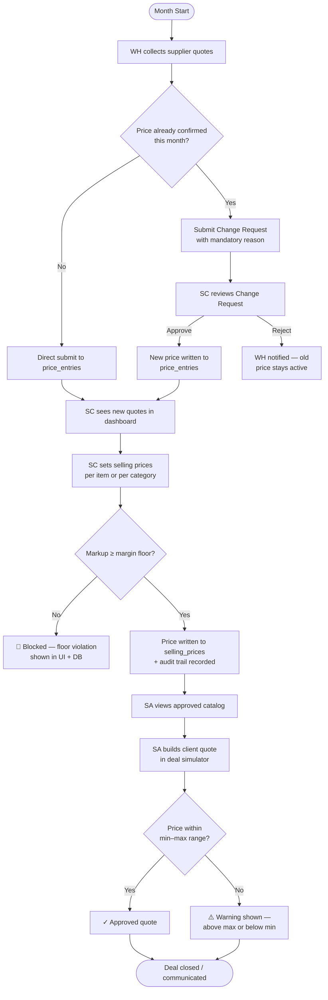
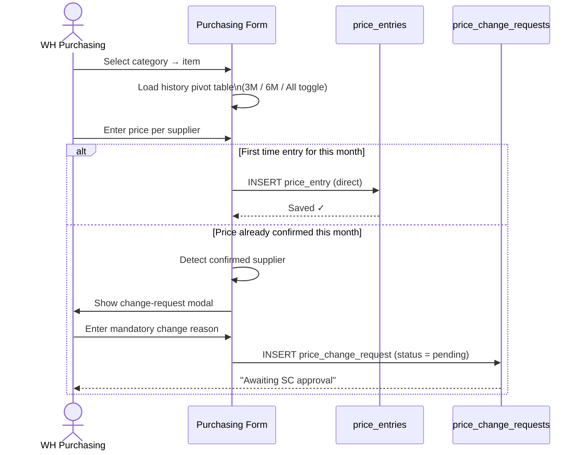
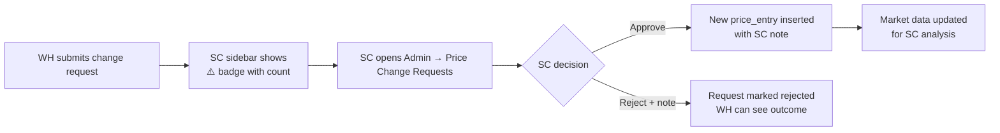
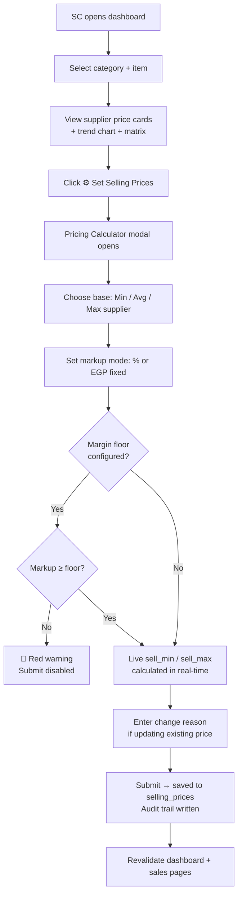
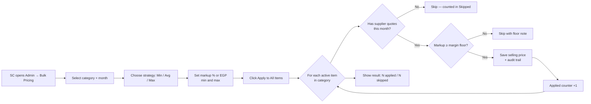
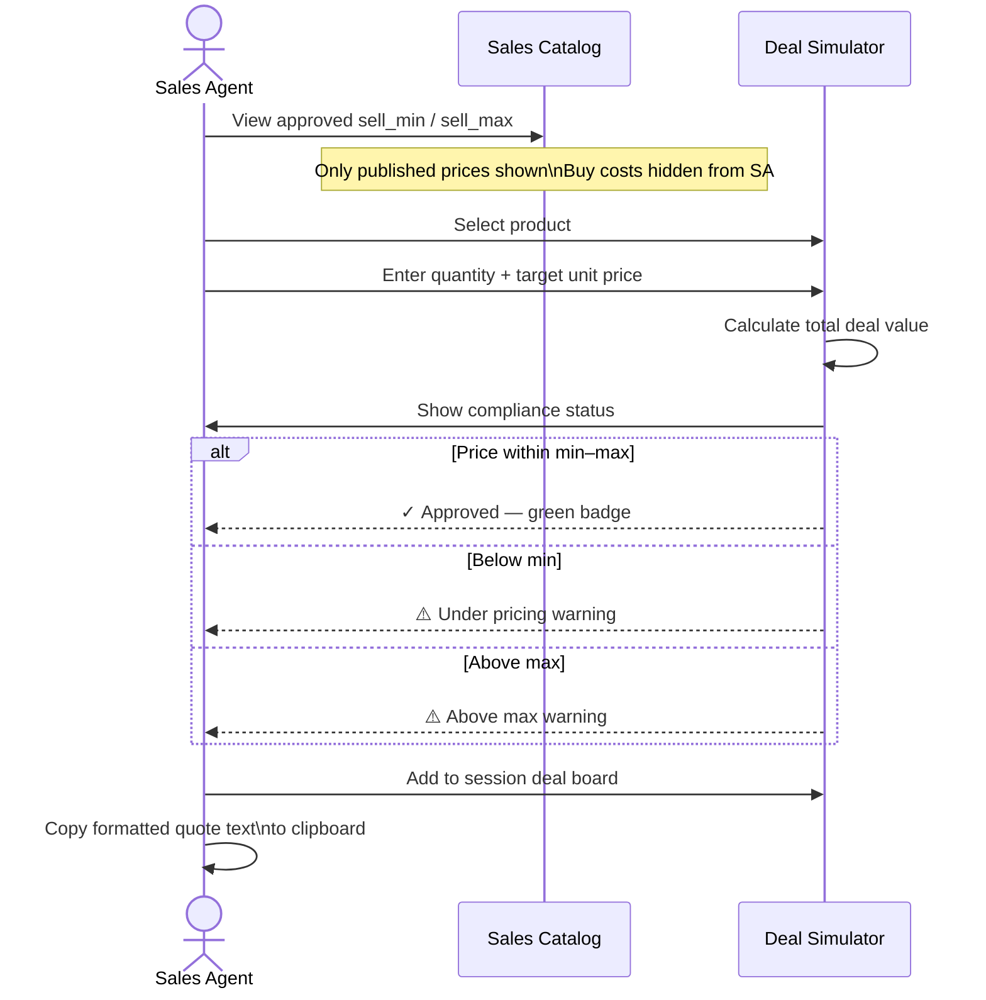
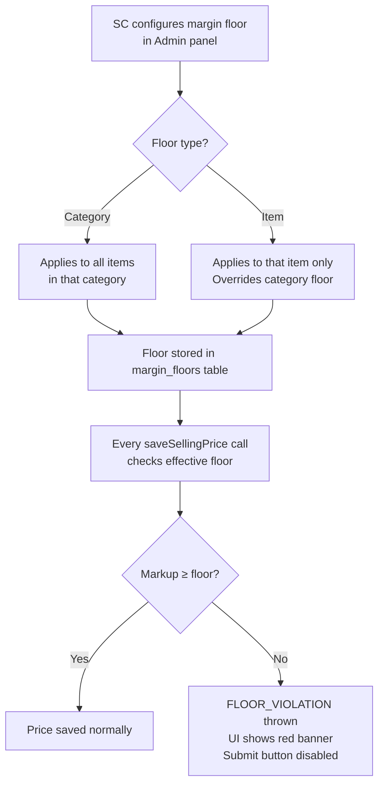
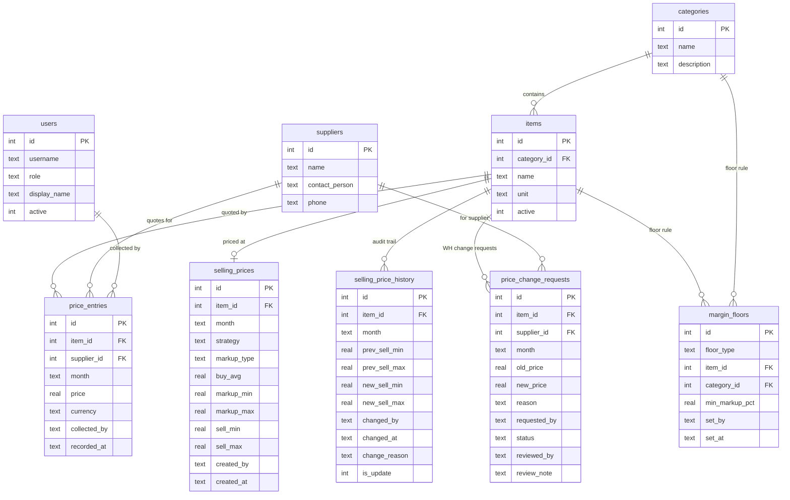

# FAERP — Full Application Workflow

> On-premise ERP for monthly supplier pricing, margin management, and resale control.  
> Three roles, four stages, one cycle per month.

---

## Role Overview

| Role | Code | Purpose |
|------|------|---------|
| Warehouse / Purchasing | **WH** | Collect supplier quotes every month |
| Supply Chain Manager | **SC** | Analyze quotes, set selling prices, manage margins |
| Sales Agent | **SA** | View approved prices, build client quotes |

---

## Monthly Cycle — High-Level Flow

---

## Stage 1 — Price Collection (WH Role)

**Key rules:**
- Month is always locked to the current calendar month — no backdating
- Each supplier × item × month can have multiple raw entries; only the **latest by `recorded_at`** is used for analysis
- Prices are in **EGP** (Egyptian Pound) — all inclusive (transport, customs, handling)
- Change requests remain pending until SC acts; the original price is live until then

---

## Stage 2 — Price Change Request Review (SC Role)

**SC is notified via:**
- Animated warning badge on the **Admin** nav link in the sidebar
- Count resets to zero when all requests are resolved

---

## Stage 3 — Selling Price Setting (SC Role)

### Option A — Single item via Pricing Calculator

### Option B — Bulk category via Admin panel

### Option C — Monthly Review Modal (batch item-by-item)

SC can open the **Monthly Review** modal from the dashboard header to work through all items in one screen — search, filter by Published/Pending, expand each item, see supplier cards + 3–9 month history table, and enter sell_min / sell_max inline with a single Save button per item.

---

## Stage 4 — Sales Catalog & Deal Quoting (SA Role)

---

## Margin Floor Enforcement (SC Role — Admin)

**Precedence:** Item-level floor > Category-level floor > No floor

---

## Audit Trail (Automatic — no user action required)

Every time a selling price is **created or updated**, the system automatically:
1. Snapshots the **previous** values (sell_min, sell_max, markup%, strategy, buy_avg)
2. Records the **new** values
3. Stores who changed it, when, and any change reason entered
4. Marks whether it was a **first publish** or an **update**

This is visible inside the Pricing Calculator modal as a collapsible "Price Change Audit Trail" — newest entry first.

---

## Data Model Summary

---

## Navigation by Role

| Page | WH | SC | SA |
|------|----|----|----|
| `/dashboard` — Overview + pricing engine | ✓ read | ✓ full | ✗ |
| `/dashboard/purchasing` — Price collection | ✓ | ✓ | ✗ |
| `/dashboard/manager/analytics` — Market intelligence | ✗ | ✓ | ✗ |
| `/dashboard/sales` — Approved catalog + deal simulator | ✗ | ✓ read | ✓ |
| `/dashboard/reports` — CSV / print reports | ✗ | ✓ | ✗ |
| `/dashboard/admin` — Users, categories, suppliers, items, margin floors, bulk markup, change requests | ✗ | ✓ | ✗ |
| `/dashboard` — Approved price list only | ✗ | ✗ | ✓ |

---

## Tech Stack

| Layer | Technology |
|-------|-----------|
| Framework | Next.js 14 App Router (React Server Components + Server Actions) |
| Database | SQLite via `better-sqlite3` — single file at `data/faerp.sqlite` |
| Auth | Cookie-based session (`faerp-user`) — role stored in cookie |
| Styling | Plain CSS custom properties — light default, dark theme toggle |
| i18n | Custom context — English / Arabic with RTL layout support |
| Charts | Hand-crafted SVG (no chart library dependency) |
| Currency | Egyptian Pound (EGP) — all prices stored and displayed in EGP |
| Deployment | On-premise — runs on any Node.js 18+ machine on the local network |
